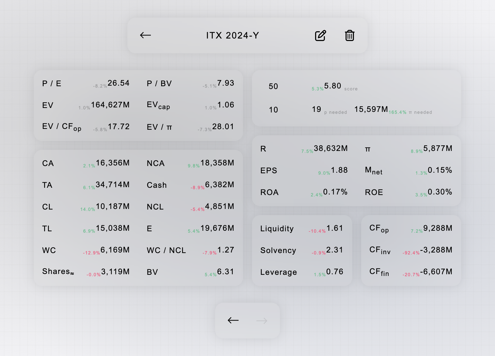

# Intrinsic

Intrinsic is a Javascript Electron-based desktop app that processes financial
reports, extracts and stores key metrics, and helps you quickly analyze
companies and track their finances.

<p align="center">
  
</p>

The name _intrinsic_ comes from Benjamin Graham’s famous concept of intrinsic
value. The true worth of a company based on its fundamentals, rather than market
speculation. The app is designed to bring this philosophy into your workflow,
giving you a clear, data-driven view of businesses you’re evaluating.

## Installation

### Prerequisites

- Git.
- Node.js.
- OpenAI API key (enable GPT-5-mini). _(Intrinsic currently only supports
  OpenAI’s GPT-5-mini. Support for additional providers and models is
  planned.)_.

### Install

```sh
git clone https://github.com/genbraham/intrinsic
cd intrinsic
npm install
npm run build
cd ..
rm -rf intrinsic
```

### Launch

To start Intrinsic double-click installed app.

- macOS: /Applications/Intrinsic.app (If you don’t have permissions, it’s
  installed to ~/Applications/Intrinsic.app.)
- Windows: Start Menu → Programs → Intrinsic (shortcut is created), or
  %LOCALAPPDATA%\Programs\Intrinsic\Intrinsic.exe
- Linux: app launcher (GNOME/KDE) after build; or run
  ~/.local/share/Intrinsic/Intrinsic

```sh
# You can also enable terminal launch. Within the project directory →
npm link
# Then from anywhere within the terminal →
intrinsic
```

## Usage

### Settings

**Important: The first time you start Intrinsic, you must provide an API key for
it to work (go to the gear icon → Environment Settings).**

When you launch Intrinsic, you’ll see a gear icon in the top-center menu. There
you can configure:

- **Ordering** of your tickers. Submission or alphabetical order (asc / desc).
- **Language** (Spanish / English).
- **TTM** (enabled / disabled). Use TTM when calculating ratios or focus on
  natural periods.
- **Environment** switch between AI providers and models, set API keys, and
  specify file paths for the fileWriter if you want to inspect pipeline steps.
- **Accent color** of the app.
- **Version** of Intrinsic. Check for updates.
- **Nuke** all your Intrinsic data (factory reset).

### Input fields

Once your API key is set, you can add companies by clicking the “+” button.
Please take a moment to review [docs/common-errors.md](docs/common-errors.md).

After clicking “+”, the input fields will appear:

**Mandatory fields**:

- **Ticker** (name).
- **Period** — must follow one of these formats:
  - Year: YYYY-Y, e.g.: 2024-Y. To prevent errors, the -Y suffix is required.
  - Quarter: YYYY-Q#, e.g.: 2024-Q1. If “3 previous months” and “9 previous
    months” are reported, the pipeline will try to extract data relative to the
    3 previous months.
  - Semester: YYYY-S#, e.g.: 2024-S1.
- **Source**. Directly type an URL on the field or click the file icon to submit
  a file. Intrinsic currently supports .pdf, .html, .xhtml, .mhtml, .mht
  formats. Client-side rendered (CSR) websites are not supported; to attach one:
  right click → Save As → 'Single File' or 'Page Source', then submit the file.
  Banks and insurance companies are not supported, as they do not follow
  traditional standard report formats.

**Optional fields**:

- **Start** page.
- **End** page.

PDFs pages-selection works perfectly. HTML page detection relies on
document.querySelectorAll('.pageView'), so page selection is not guaranteed to
work.

It’s recommended to fill in page values in the following cases:

1. **Improve processing speed**. Huge files take longer and consume more
   resources. If you’re sure the results appear in, say, the first 10 pages, set
   End to 10.
2. **Improve precision**. For example, ASML presentations often include
   financial statements around page 240. You could set Start: 240 and End: 260.
3. **Avoid mistakes**. Many reports include both individual and consolidated
   statements. If you know consolidated statements start at page 10, set
   Start: 10.

When you submit, the pipeline runs. See [docs/pipeline.md](docs/pipeline.md) for
a detailed explanation of the pipeline.

Because the files can be large and complex, the organization and clarity of the
content are crucial for correct extraction. The AI can make mistakes. After
adding a company, if you detect any error you can manually modify values in the
data display UI by clicking the **edit** icon.

You can **delete** specific periods. To delete a company, delete all its periods
from within the company view.

### Data displayed

In a company view you can examine the company’s finances, compare data YoY
(year-over-year), and simulate scenarios for desired prices or P/E ratios and
the required net income.

<details>
<summary><strong>Abbreviations</strong> are used for data labels to simplify visualization.</summary>

**Data that requires a stock price to calculate:**

- **P / E**: _Price to Earnings Ratio_, stock price divided by net earnings per
  share.
- **P / BV**: _Price_ / Book Value, stock price divided by book value per share.
- **EV**: _Enterprise Value_, market capitalization plus debt minus cash.
- **EV<sub>cap</sub>**: _Enterprise Value_ to market capitalization.
- **EV / CF<sub>op</sub>**: _Enterprise Value_ divided by operating cash flow.
- **EV / π**: _Enterprise Value_ divided by net profit.

**Other data:**

- **CA**: Current Assets.
- **NCA**: Non-Current Assets.
- **TA**: Total Assets.
- **Cash**: Cash and cash equivalents.
- **CL**: Current Liabilities.
- **NCL**: Non-Current Liabilities.
- **TL**: Total Liabilities.
- **E**: Shareholders' Equity.
- **WC**: Working Capital, current assets minus current liabilities.
- **WC / NCL**: Working Capital divided by non-current liabilities.
- **Shares<sub>≈</sub>**: approximate shares. Given the inconsistency in
  financial file formats and different accounting practices, an approximation is
  calculated using net profit and EPS.
- **BV**: Book Value, shareholders' equity divided by shares.
- **R**: Revenue.
- **π**: Net Profit.
- **EPS**: Earnings Per Share. Will try to obtain the non-diluted value.
- **M<sub>net</sub>**: Net margin. Net profit divided by revenue.
- **ROA**: _Return on Assets_, net profit divided by total assets.
- **ROE**: _Return on Equity_, net profit divided by shareholders' equity.
- **Liquidity**: current assets divided by current liabilities.
- **Solvency**: total assets divided by total liabilities. If shareholders'
  equity is negative, "NA" will be shown, not available.
- **Leverage**: total liabilities divided by shareholders' equity. If
  shareholders' equity is negative, "NA" will be shown, not available.
- **CF<sub>op</sub>**: operating cash flow.
- **CF<sub>inv</sub>** investment cash flow.
- **CF<sub>fin</sub>**: financing cash flow.

</details>

If you’ve added the corresponding period from the previous year, the YoY
variation is shown as a percentage next to each data point.

At the top-right of the company financials view there are two inputs. One shows
the company’s stock price, where you can enter a value (e.g., the current or a
target price). The other shows “w P / E”, where you can enter a desired P/E
ratio.

- If you have **filled in the price box**, a score for the company at that
  specific price will be shown (see score explanation below).
- If you have **filled in the P/E ratio box**, the price needed to reach the
  desired P/E ratio will be shown.
- If you have **filled in both boxes**, the net profit required to reach the
  desired P/E ratio at that price and the percentage variation required compared
  to the current net profit will be shown.

If the period is 'Q' or 'S', for the upper 2 boxes, Intrinsic tries to perform
the calculations based on TTM (trailing twelve months) data. If there is no data
available (not submitted) just uses current data for that quarter or semester.

<details>
<summary><strong>Score
</strong>is determined as follows:</summary>

Base Conditions:

- **NA** → if _Net Profit_, _Shares_, _EV_, or _P/BV_ are not valid
- **0** → if _EPS ≤ 0_ or _BV ≤ 0_ or _Operating CF ≤ 0_ or _Net Profit ≤ 0_
- **10** → if none of the above are met **and** _EV ≤ 0_
- Otherwise → **Score** = W₁R₁ + W₂R₂ + W₃R₃

Ratios:

- **R₁** = `10 * (1 - (EV/OCF) / 50)`, if `EV/OCF < 50`, else = 0
- **R₂** = `10 * (1 - (P/E) / 50)`, if `P/E < 50`, else = 0
- **R₃** = `10 * (1 - (P/BV) / 20)`, if `P/BV < 20`, else = 0

Weights:

| Case                 | W₁ (EV/OCF) | W₂ (P/E) | W₃ (P/BV) |
| -------------------- | ----------- | -------- | --------- |
| All ratios available | 0.4         | 0.3      | 0.3       |
| EV/OCF not available | –           | 0.5      | 0.5       |

</details>

### Common Errors

Please take a moment to review [docs/common-errors.md](docs/common-errors.md)
for a detailed list of frequent issues and best practices. Understanding these
cases will help you use the tool more effectively and avoid common pitfalls when
processing financial reports.

## To-dos

See [docs/todos.md](docs/todos.md) for the current development roadmap.
